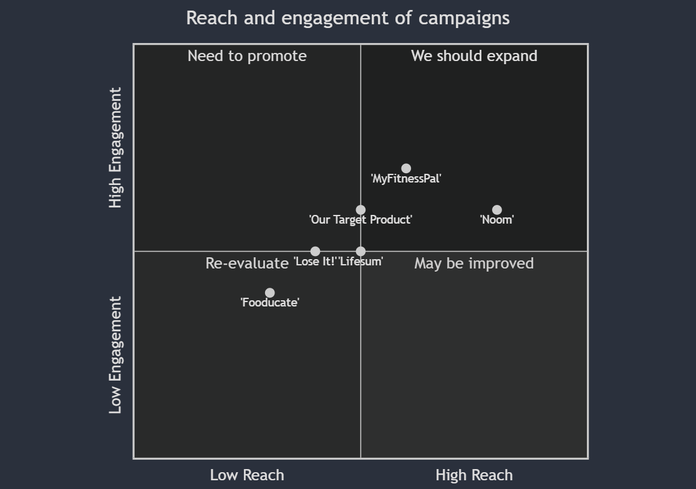

## Product Goals

- Create an application that provides personalized diet plans
- Ensure the application is user-friendly and intuitive
- Incorporate features that help track progress and adjust diet plans accordingly

## User Stories

- As a user, I want to input my personal details and health goals so that I can get a customized diet plan
- As a user, I want to track my daily food intake to ensure I am following the diet plan
- As a user, I want to receive suggestions for meals and recipes that fit my diet plan
- As a user, I want to adjust my diet plan if I am not seeing desired results
- As a user, I want to see my progress over time to stay motivated

## Competitive Analysis

- 'MyFitnessPal' offers a comprehensive diet and exercise tracking tool but lacks personalized diet plans
- 'Lose It!' provides personalized diet plans but lacks variety in meal suggestions
- 'Noom' offers a holistic approach with diet plans and psychological strategies but is expensive
- 'Fooducate' educates users about food but lacks a personalized approach
- 'Lifesum' offers diet plans and recipes but lacks a comprehensive progress tracking feature

## Competitive Quadrant Chart

## Requirement Analysis

The application needs to have features for personal details input, diet plan generation, food intake tracking, meal suggestions, diet plan adjustments, and progress tracking. The UI needs to be user-friendly and intuitive.

## Requirement Pool

- ['P0', 'Personal details input feature']
- ['P0', 'Diet plan generation feature']
- ['P1', 'Food intake tracking feature']
- ['P1', 'Meal suggestions feature']
- ['P2', 'Diet plan adjustment feature']
- ['P2', 'Progress tracking feature']

## UI Design draft

The application should have a clean and minimalist design with intuitive navigation. The home screen should display the diet plan and progress. There should be separate sections for food intake tracking and meal suggestions. The personal details input and diet plan adjustment features should be easily accessible from the settings.

## Anything UNCLEAR

The specific parameters for the personal details input and the metrics for progress tracking are not specified in the requirements.

